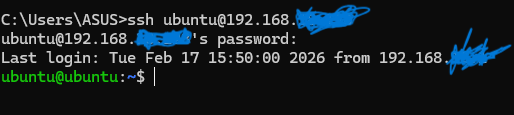
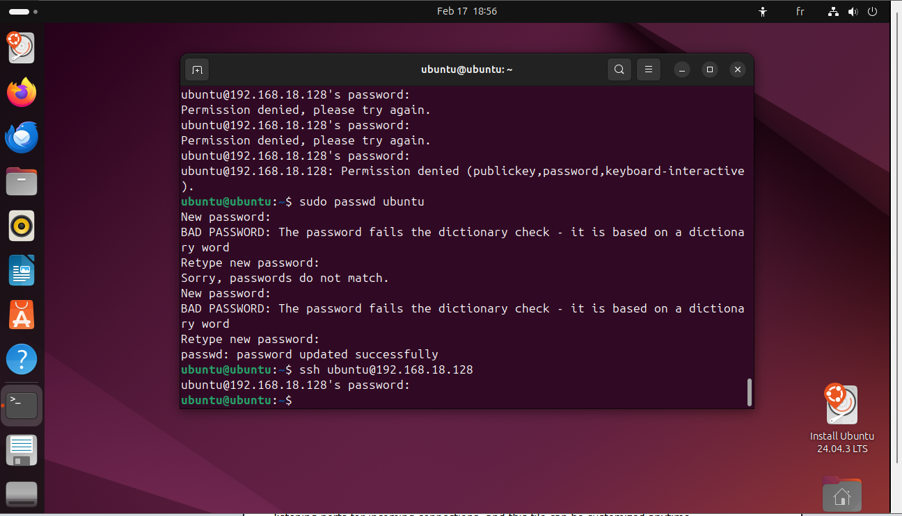

# Linux Server Administration Lab 🐧

A hands-on Linux server lab built with Ubuntu on VirtualBox, demonstrating 
system administration skills including SSH remote access, web server deployment, 
and firewall configuration.

## What's Configured

- **SSH Server** — Remote access via OpenSSH
- **Apache Web Server** — HTTP service on port 80
- **UFW Firewall** — Security rules allowing SSH and HTTP traffic
- **Network Configuration** — Static IP on VirtualBox NAT network

## Server Details

- OS: Ubuntu 24.04 LTS
- IP Address: 192.168.x.x
- Services: SSH (port 22), Apache (port 80)
- Firewall: UFW enabled with SSH and HTTP allowed

## What I Did

1. Installed and configured OpenSSH server for remote administration
2. Deployed Apache web server and verified HTTP access
3. Configured UFW firewall with security rules
4. Tested remote SSH connection from Windows client
5. Verified web server accessibility via browser

## Screenshots

### SSH Connection from Windows

### Apache Web Server Running

### UFW Firewall Status

## Technologies

- Ubuntu 24.04 LTS
- VirtualBox
- OpenSSH Server
- Apache2 Web Server
- UFW (Uncomplicated Firewall)
- Command Line Administration

## Author

Ahmed Meskache — github.com/ahmedmeskache
